# 🛍️ JiggyMart

A full-featured multi-vendor marketplace built with Laravel — customers browse and buy from many independent sellers, sellers manage their own storefronts, and admins oversee the whole platform from one dashboard.

---

## ✨ Features

**For customers**
- Browse, search, and filter products by category, price, condition, and brand
- Add to cart, checkout, and track orders through their full lifecycle
- Save favorites with a one-click wishlist heart on every product card
- Leave verified-purchase reviews and ratings
- Manage saved addresses and view transaction history
- Sign up with email/password or continue with Google

**For sellers**
- Apply to sell directly from their existing customer account — no separate signup needed
- Manage a full product catalog: create, edit, delete, upload images, track inventory
- View orders containing their products and sales analytics
- Every account can be a customer *and* a seller at the same time

**For admins**
- Approve or reject seller applications
- Manage users, products, categories, orders, transactions, and reviews
- Suspend accounts and monitor platform-wide statistics

**Under the hood**
- Full order lifecycle: pending → processing → paid → shipped → delivered (plus cancelled/refunded)
- Server-side stock and price validation at every step of checkout — nothing from the browser is ever trusted
- A mock payment gateway for local development, with a real Paystack integration ready to switch on
- REST API secured with JWT for external/mobile clients, fully separate from the website's session login

---


## 📸 Screenshots

| Home | Product Listing |
|---|---|
| 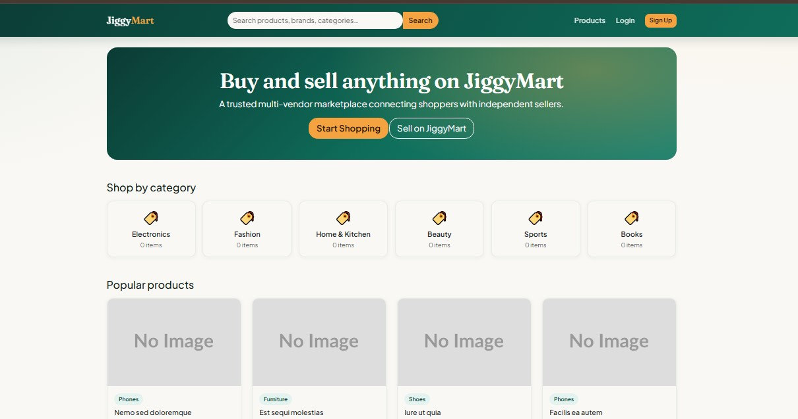 | 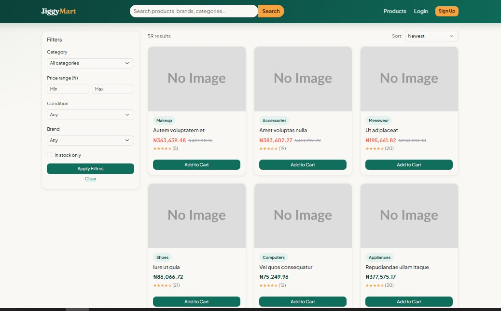 |

| Product Detail | Cart |
|---|---|
| 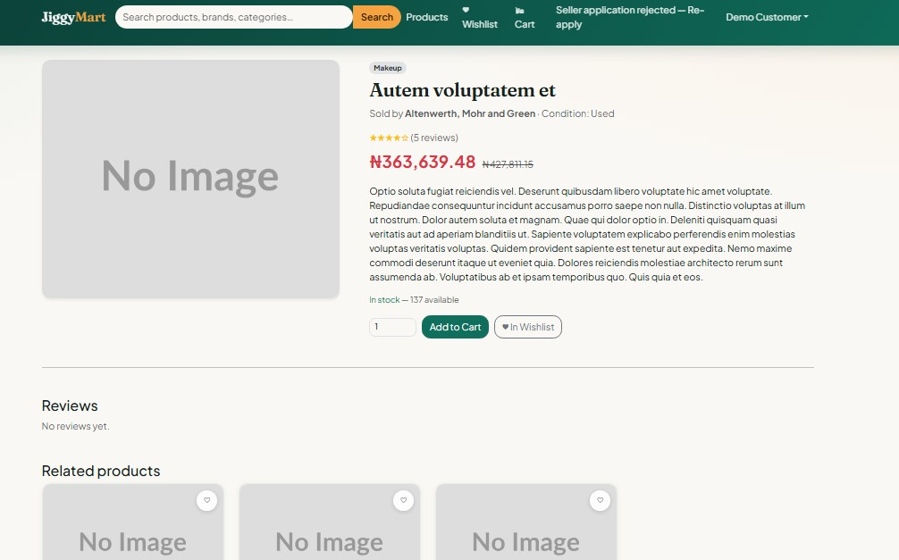 | 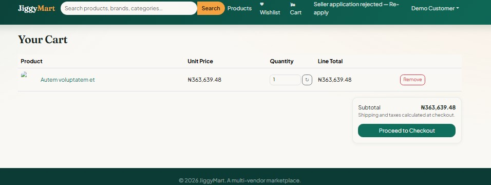 |

| Seller Dashboard | Admin Dashboard |
|---|---|
| 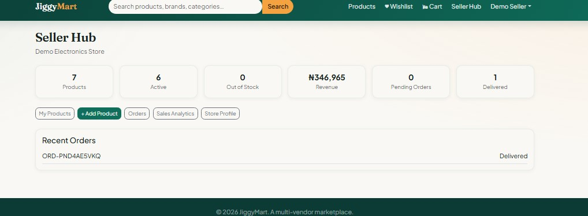 | 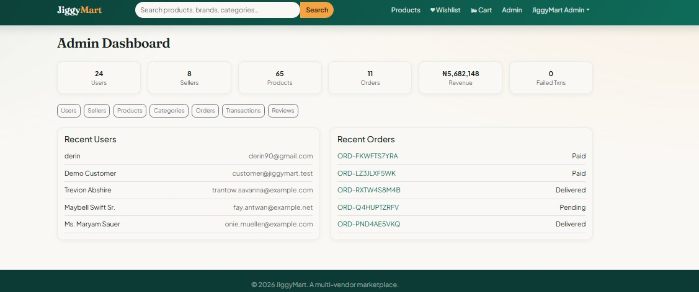 |

| Customer Dashboard | Wishlist |
|---|---|
| 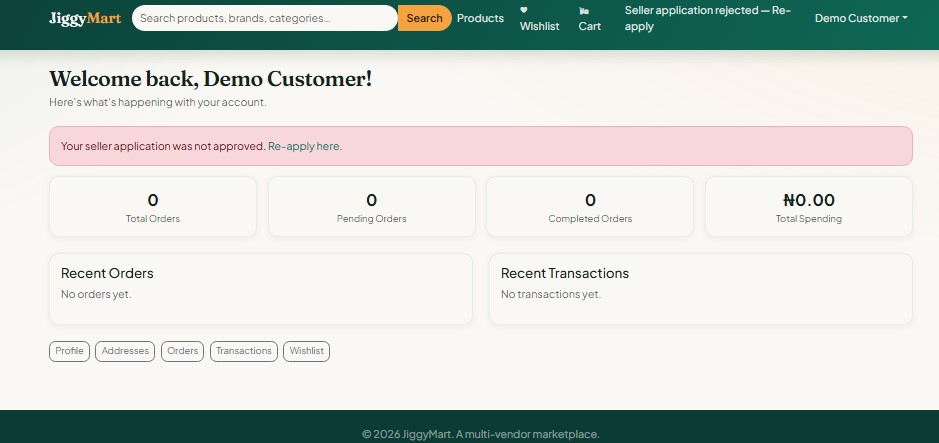 | 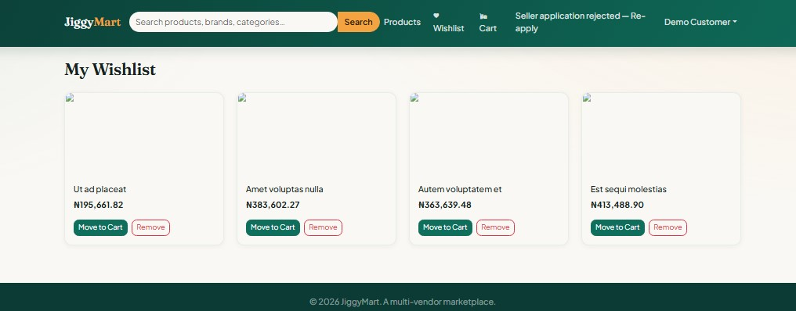 |

|  Checkout | Order placed |
|---|---|
| 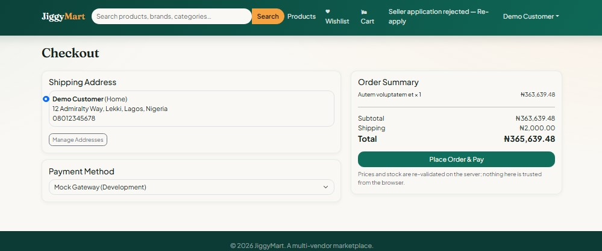 | 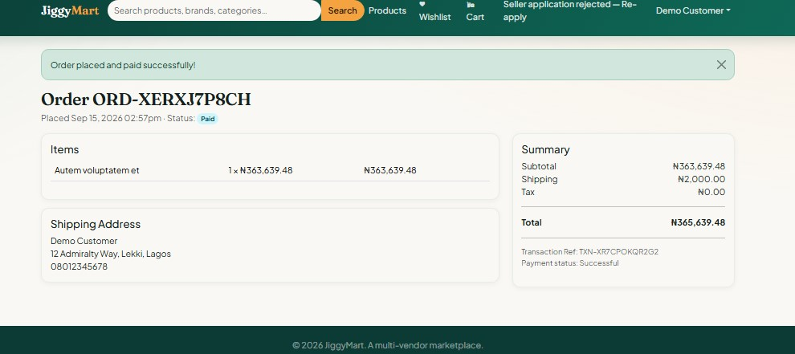 |

|  Login | Signup |
|---|---|
| 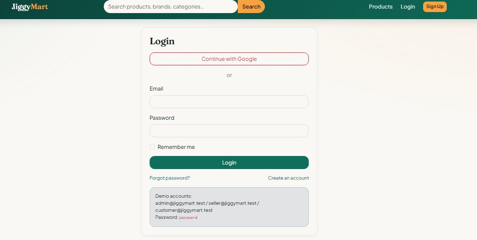 | 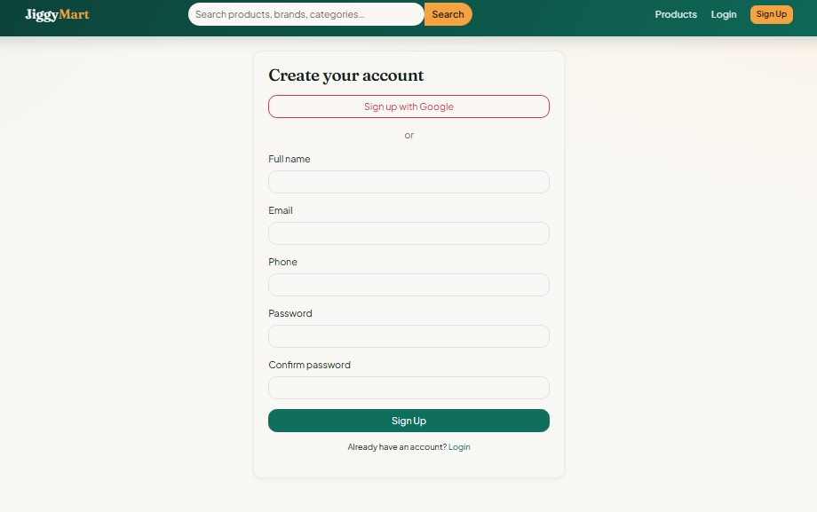 |


|  Checkout | Order placed |
|---|---|
|  |  |

---


## 🧱 Tech Stack

| Layer | Technology |
|---|---|
| Backend | PHP 8.3, Laravel 11 |
| Database | SQLite |
| Frontend | Blade templates, Bootstrap 5 |
| Auth | Session login, Google OAuth (Socialite), JWT (API) |
| Payments | Mock gateway (dev) / Paystack (production) |
| Testing | PHPUnit |

---

## 🚀 Getting Started

### 1. Install dependencies
```bash
composer install
```

### 2. Set up your environment
```bash
cp .env.example .env
php artisan key:generate
php artisan jwt:secret
```

### 3. Create the database
```bash
type nul > database\database.sqlite      # Windows
touch database/database.sqlite           # macOS/Linux

php artisan migrate:fresh --seed
```

This seeds an admin account, several sellers, customers, a full category tree, ~65 products, and sample orders/reviews so the app feels alive right away.

### 4. Link storage (for product images)
```bash
php artisan storage:link
```

### 5. Run it
```bash
php artisan serve
```
Visit **http://127.0.0.1:8000**

---

## 🔑 Demo Accounts

| Role | Email | Password |
|---|---|---|
| Admin | `admin@jiggymart.test` | `password` |
| Seller (pre-approved) | `seller@jiggymart.test` | `password` |
| Customer | `customer@jiggymart.test` | `password` |

---

## 🛒 How the Core Flow Works

**Becoming a seller** — Any customer can apply from the "Sell on JiggyMart" link. This doesn't create a new account; it adds a seller role on top of their existing one, with status `pending`. An admin then approves or rejects the application from the admin dashboard. Once approved, that same account gets full access to the Seller Hub — while still being able to shop as a customer, since the two roles aren't mutually exclusive.

**Checkout** — When an order is placed, JiggyMart re-checks stock and re-prices every item against the live database before charging anything, all inside a single database transaction. If payment fails after stock was reserved, that stock is automatically released and the order is cancelled — nothing is ever left in a half-completed state.

**Payments** — By default, checkout runs through a mock gateway that auto-approves every charge, so you can test the full purchase flow without any payment provider setup. To go live, add real Paystack keys to `.env`:
```
PAYMENT_GATEWAY_KEY=pk_...
PAYMENT_GATEWAY_SECRET=sk_...
```
No code changes needed — the switch is automatic.

---

## 📧 Optional Integrations

| Feature | What it enables | Setup |
|---|---|---|
| **Mail (SMTP)** | Password resets, order confirmations, shipping updates actually send | Add SMTP credentials (e.g. from [Mailtrap](https://mailtrap.io) for testing) to `.env` |
| **Google OAuth** | "Continue with Google" login | Create credentials in [Google Cloud Console](https://console.cloud.google.com/), add `GOOGLE_CLIENT_ID`/`GOOGLE_CLIENT_SECRET`/`GOOGLE_REDIRECT_URI` to `.env` |
| **Paystack** | Real payment processing | Add `PAYMENT_GATEWAY_KEY`/`PAYMENT_GATEWAY_SECRET` to `.env` |
| **Queue worker** | Notifications send in the background instead of on the request thread | Run `php artisan queue:work` alongside `php artisan serve` |

---

## 🧪 Running Tests

```bash
php artisan test
```

Covers registration, login, Google OAuth linking, seller product authorization, search/filtering, cart operations, full checkout (including stock-tamper and payment-failure paths), inventory, reviews, role permissions, and JWT authentication.

---

## 📁 Project Structure

```
app/
├── Models/            Eloquent models and relationships
├── Http/
│   ├── Controllers/
│   │   ├── Auth/       Login, registration, OAuth, password reset
│   │   ├── Web/        Customer/seller/admin-facing pages
│   │   └── Api/        JSON API + JWT auth
│   ├── Requests/       Form validation
│   └── Resources/      API response formatting
├── Services/           Business logic: cart, checkout, inventory, payments, orders
├── Policies/           Who can do what
└── Notifications/      Order & account emails

database/
├── migrations/
├── seeders/
└── factories/

resources/views/         Blade templates
routes/{web,api}.php
tests/
```

---

## 🌐 API

Base path: `/api`. Public catalog browsing needs no auth; everything else requires a JWT bearer token from `/api/auth/login`.

```
POST /api/auth/register
POST /api/auth/login
GET  /api/auth/me

GET  /api/products
GET  /api/products/{slug}
GET  /api/categories

GET/POST/PUT/DELETE  /api/cart, /api/cart/items/{id}
GET/POST             /api/orders
GET                  /api/transactions
```

---
## 👨‍💻 Author

Atunde Toheeb Ayomide (Jiggy)  
📍 Lagos, Nigeria  
📧 [atundetoheeb1@gmail.com](mailto:atundetoheeb1@gmail.com)  
🔗 [GitHub](https://github.com/ceezign) | [LinkedIn](https://www.linkedin.com/in/atunde-toheeb-551826313)
💼 [Website](https://atunde-portfolio-web.vercel.app/)

## 📄 License

MIT — free to use, modify, and share.

Built with Laravel. Happy selling! 🎉